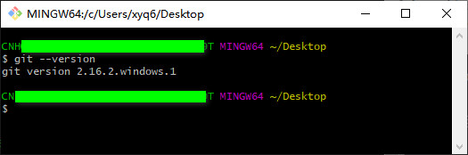
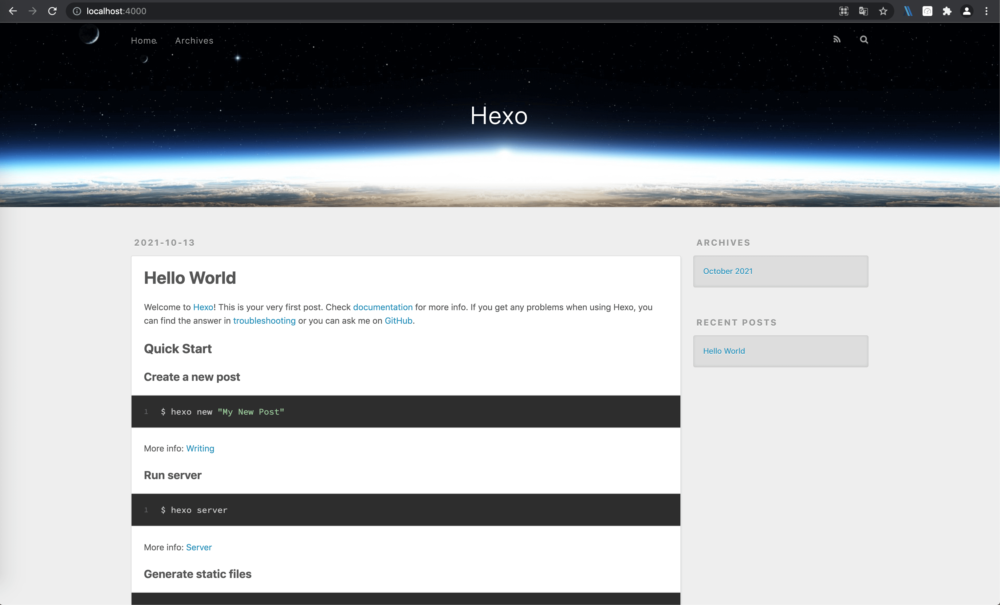
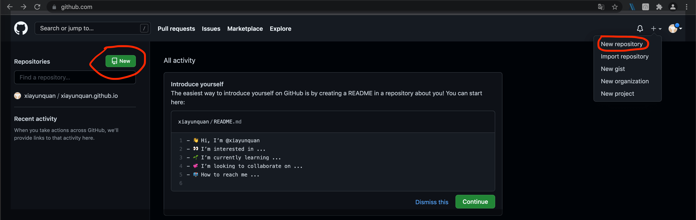
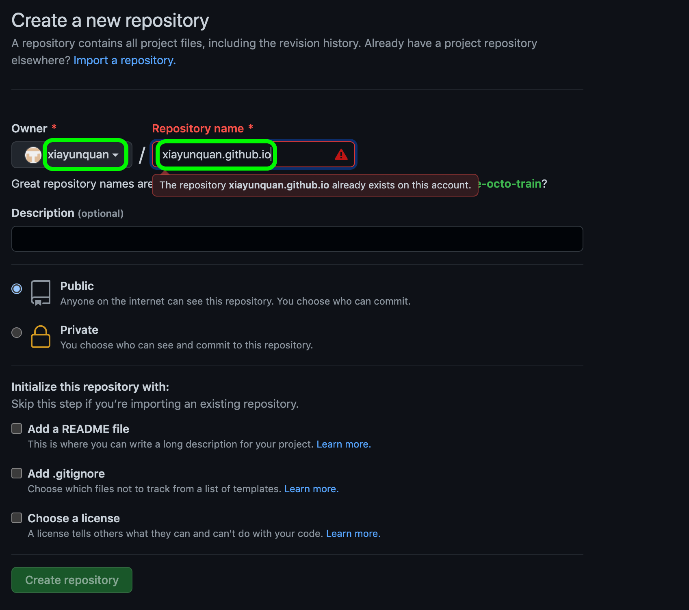
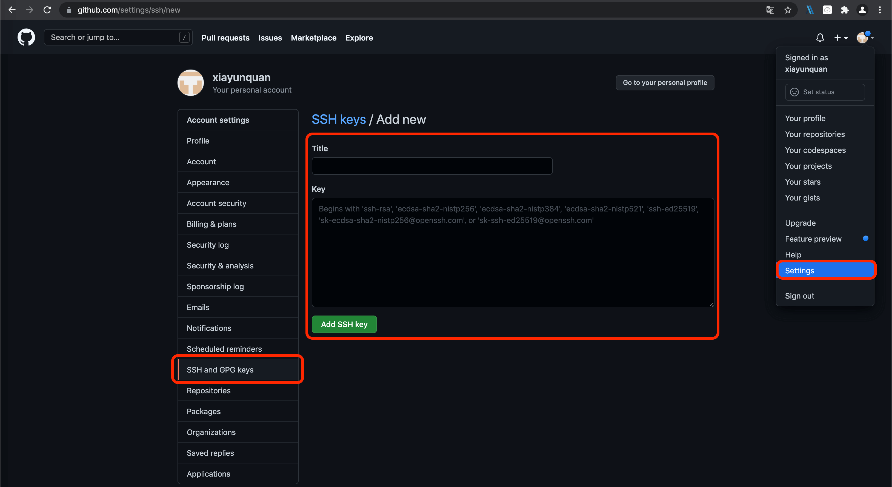

[GitCmd]:./HexoBlogBuildAndConfig/GitCmd.jpg	"Git"
[Git]:./HexoBlogBuildAndConfig/Git.jpg
[LivereInstall]:./HexoBlogBuildAndConfig/LivereInstall.jpg
[livere]:./HexoBlogBuildAndConfig/livere.jpg

### 前言

现在各种互联网博客非常的，常见的如CSDN、简书、掘金、博客园等平台，这些博客平台做的都很好，可以直接在上面注册自己的账号写文章，发表的文章在百度、Bing等搜索引擎上也能收到，但缺点是受于平台的各种限制，个人定制化不自由，而且大多数平台都会有各种广告。

于是想到自己搭建一个博客网站，但对大多数人而言，自己购买服务器和域名来搭建博客成本实在太高的了，而且有点浪费，还需要定期维护，这时一种不错的选择就是使用第三方开源托管平台（GitHub、GitLab等）来当作我们的服务器，并使用快速简洁的博客搭建框架-[Hexo](https://hexo.io/zh-cn/)来搭建博客网站就非常容易了，下面就来介绍一下使用hexo搭建博客的步骤及一些配置吧。

### Hexo简介

Hexo是由台湾大佬开发的一款基于Node.js的静态博客框架，依赖少易于安装使用，可以方便的生成静态网页托管在GitHub、Coding、Gitlab等平台上，是搭建博客的首选框架。而且Hexo支持Markdown的所有语法功能来编辑网页内容，编辑的内容生产静态网页速度很快，上百个页面在几秒内瞬间完成渲染。Hexo部署发布也很方便，只需要一条指令即可发布到配置GitHub、 Heroku 等平台。下面就开始一步步的完成搭建吧，大家也可以进入[Hexo官网](https://hexo.io/zh-cn/)查看详细的搭建教程。

### 1. 安装Git

[Git](https://git-scm.com/downloads)是目前世界上最先进的分布式版本控制系统，可以有效、快速的处理各种项目版本管理。在这里就是用来管理我们写的Hexo博客文章，并上传到GitHub等平台的工具。

在Mac和Linux系统上安装Git非常容易。

**Mac**电脑上安装只需要执行下面的命令即可，使用[Homebrew](https://brew.sh/index_zh-cn)来安装

```shell
brew install git
```

**Linux**是一个开源的操作系统，市面上有很多优秀的Linux系统，不同的系统上安装Git执行的命令可能略有不同，具体的查看[Git官网](https://git-scm.com/download/linux)上对应系统的安装命令，这里以Ubuntu系统安装Git为例。

```shell
sudo apt-get install git
```

**Windows** 上安装需要先[下载Git安装包]([https://gitforwindows.org/)，然后点击安装包使用默认的配置一步步安装就可以了。

安装完成之后在命令执行窗口输入`git --version`即可检查是否安装成功，并能看到安装的git版本号。

![GitCmd]

Git有一个专门命令行工具Git Bash，Windows在任何地方只要鼠标右键，然后点击`Git Bash Here`就可以在当前目录路径下打开命令行窗口了。



### 2. 安装nodejs

Hexo是基于[nodeJS](https://nodejs.org/en/download/)编写的，所以需要安装一下nodeJs和里面的npm工具。

Windows和Mac上面安装，下载nodejs的LTS版本的进行安装就可以了。

Linux上面安装直接执行下面的命令即可：

```shell
sudo apt-get install nodejs
sudo apt-get install npm
```

安装成功之后可以使用下面的命令查看是否安装成功及对应版本号：

```shell
node -v
npm -v
```


### 3. 安装Hexo

前面git和nodejs安装好后，就可以安装hexo了，你可以先创建一个文件夹如blog，然后`cd`到这个文件夹下（或者在这个文件夹下直接右键git bash here打开）。

输入下面的命令安装Hexo：

```shell
npm install -g hexo-cli
```

然后可以使用`hexo -v`查看是否安装成功及hexo的版本号。

Hexo安装之后，再执行下面命令初始化Hexo项目，这里的`Blog`名称可以随便取。

```shell
hexo init Blog
cd Blog
npm install
```

初始化成功之后，会在当前目录下面创建一个Blog文件夹，Blog文件下面会生成下面这些目录文件：

- node_modules: 依赖包
- scaffolds：生成文章的一些模板
- source：用来存放你的文章
- themes：主题
- _config.yml: 博客的配置文件

然后可以使用下面的命令生成静态网页

```shell 
hexo generate 或简写成 hexo g
```

最后启动本地服务可以让我们在浏览器上本地预览一下网页

```shell
// 开启本地服务，可以使用 Ctrl + C 停止服务
hexo server 或简写成 hexo s 
```

服务开启之后，就可以在浏览器上面输入下面的地址访问Hexo网页了

```http
http:localhost:4000 或 http://127.0.0.1:4000
```



到此，我们的博客已经实现了在本地服务器上面访问了，但是我们还需要将我们的博客发布到远程服务器上，让更多的人访问。

### 4. 将Hexo博客托管到第三方平台

我们可以将我们的博客托管到GitHub、Gitlab、Coding等平台上面，这里以GitHub为例，其他平台操作步骤大致相同。

#### 4.1 创建一个GitHub个人仓库

首先，你先要有一个GitHub账户，可以使用邮箱注册。

注册完登录后，在gitHub.com中看到一个New repository，点击新建仓库。



创建一个和你用户名相同的仓库，后面加.github.io，只有这样，将来要部署到GitHub page的时候，才会被识别，也就是xxxx.github.io，其中xxx就是你注册GitHub的用户名。我这里是已经建过了。



输入仓库名之后直接点击Create repository就可以了。


#### 4.2 生成SSH并添加到GitHub

首先需要配置一下Git的user.name和user.email信息，直接使用下面的命令：

```git
git config user.name "your github account"
git config user.email "your email"
```

这里的user.name输入你的GitHub用户名，user.email输入你GitHub的邮箱。这样GitHub才能知道你是不是对应它的账户。配置之后可以使用

```git
git config user.name
git config user.email
```

来查看配置的信息，然后执行下面的命令创建SSH。

```
ssh-keygen -t rsa -C "your email"
```

输入命令之后会提示输入密码，不用管直接一路回车，最后会在你的计算机用户（如WIndows为C:/Users/xyq/）下面生成一个`.ssh`文件夹（需要设置显示隐藏文件及文件夹），可以看到.ssh文件下面有2个文件`id_rsa`和`id_rsa.pub`,

ssh，简单来讲，就是一个秘钥，其中，id_rsa是你这台电脑的私人秘钥，不能给别人看的，id_rsa.pub是公共秘钥，可以随便给别人看。把这个公钥放在GitHub上，这样当你链接GitHub自己的账户时，它就会根据公钥匹配你的私钥，当能够相互匹配时，才能够顺利的通过git上传你的文件到GitHub上。

而后在GitHub的setting中，找到SSH keys的设置选项，点击New SSH key
把你的id_rsa.pub用记事本打开，然后把里面的全部信息复制到Key里面，Title可以随便填写，然后点击Add SSH Key就可以了。



然后输入下面的命令可以查看我们的配置是否成功：

```shell
ssh -T git@github.com
```


#### 4.3 将Hexo发布到GitHub

这一步，我们就可以将Hexo和GitHub关联起来，也就是将Hexo生成的文章部署到GitHub上，打开站点配置文件 `_config.yml`，翻到最后，修改为如下配置：

```
deploy:
  type: git
  repo: 
    github: git@github.com:xiayunquan/xiayunquan.github.io.git,master
    coding: your_coding_project_url,master
```

type就是仓库管理系统，我们用的是git；repo就是代码托管平台，这里需要配置你的仓库地址和git分支，仓库地址可以使用`https`地址或`ssh`地址2种方式，因为我们已经配置了ssh公钥，所以这里使用ssh地址的形式。

配置文件修改好了之后，接下来就是发布网站了，但首先我们要安装一下`hexo-deployer-git`这个插件，

```
npm install hexo-deployer-git --save
```

最后执行下面的命令就可以把网站部署到GitHub了

```shell
// 清楚生成的缓存数据
hexo clean

// 生成静态网页内容
hexo generate 或 hexo g

// 发布
hexo deploy 或 hexo d
```

当看到命令窗口打印`INFO Deploy done:git`就说明部署成功了，过一会儿就可以在`https://yourGithubName.github.io` 这个网站看到你的博客了！！


### 为文章添加评论功能

Hexo评论模块的配置有很多种方式，这里推荐一个[livere](https://www.livere.com/apply) ，是韩国的一个评论系统，支持免费和收费2中模式，一般个人博客使用免费版本就可以了。

首先需要注册一个账号并登录，然后安装免费版本（City版），

![LivereInstall]

点击现在安装然后填写相关信息就可以看到一个配置js代码了，我们这里只需要使用代码里面的uid就可以了。

![livere]

拿到uid之后，我们需要配置一下我们的themes目录下面的_config.yml文件中的livere信息就好了，我使用的主题是hexo-theme-matery，配置如下：

```shell 
livere:
  enable: true
  uid: 刚刚拿到的uid
```

最后执行`hexo g` 和 `hexo d`命令来成本网页并发布就可以看到每篇文章后面出现来必力评论模块了。

### 安装本地图片插件

在Markdown语法中显示一张图片，需要这张图片的链接地址，如果是本地使用，则直接使用本地图片的绝对路径就可以了，而如果生成静态网页就需要先把图片上传到服务器获取图片链接，市面上有一些免费的图片服务器，你也可以购买自己的服务器专门来管理图片，其实我们可以为Hexo安装一个插件[hexo-asset-image](https://github.com/CodeFalling/hexo-asset-image) 把本地图片直接发布到托管平台，然后生成图片链接。

首先需要安装hexo-asset-image插件：

```shell
npm install https://github.com/CodeFalling/hexo-asset-image --save
```

然后我们新建一篇文章“HexoImageExample”的时候，会在`_posts` 目录下面同时生成一个以“HexoImageExample”命名的文件夹以及一个HexoImageExample.md文件，这个文件夹就是用来存放图片的。

我们打开HexoImageExample.md文件，使用下面的语法来定义图片及显示图片：

```markdown
---
title: HexoImageExample
date: 2021-10-13 14:41:03
---

// 定义图片
[image]: ./HexoImageExample/image.jpg	"ImageTitle"
[image2]: ./HexoImageExample/image2.jpg

// 显示图片
![image]

// 或者直接使用下面这种常规方式显示

```

这里需要注意的是图片的路径需要加上`./HexoImageExample`

最后改一下配置文件`_config.yml`里面的`post_asset_folder`属性值，改成`true`。

最后直接执行`hexo g` 和 `hexo d`命令来成本网页并发布就可以了。


>  参考链接：[https://blog.csdn.net/sinat_37781304/article/details/82729029](https://blog.csdn.net/sinat_37781304/article/details/82729029)

