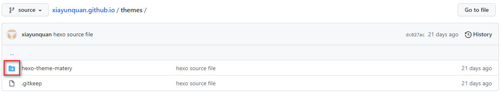

[GitCmd]:./HexoBlogBuildAndConfig/GitCmd.jpg	"Git"
[Git]:./HexoBlogBuildAndConfig/Git.jpg
[LivereInstall]:./HexoBlogBuildAndConfig/LivereInstall.jpg
[livere]:./HexoBlogBuildAndConfig/livere.jpg

### 前言

现在各种互联网博客非常的，常见的如CSDN、简书、掘金、博客园等平台，这些博客平台做的都很好，可以直接在上面注册自己的账号写文章，发表的文章在百度、Bing等搜索引擎上也能收到，但缺点是受于平台的各种限制，个人定制化不自由，而且大多数平台都会有各种广告。

于是想到自己搭建一个博客网站，但对大多数人而言，自己购买服务器和域名来搭建博客成本实在太高的了，而且有点浪费，还需要定期维护，这时一种不错的选择就是使用第三方开源托管平台（GitHub、GitLab等）来当作我们的服务器，并使用快速简洁的博客搭建框架-[Hexo](https://hexo.io/zh-cn/)来搭建博客网站就非常容易了，下面就来介绍一下使用hexo搭建博客的步骤及一些配置吧。

### Hexo简介

Hexo是由台湾大佬开发的一款基于Node.js的静态博客框架，依赖少易于安装使用，可以方便的生成静态网页托管在GitHub、Coding、Gitlab等平台上，是搭建博客的首选框架。而且Hexo支持Markdown的所有语法功能来编辑网页内容，编辑的内容生产静态网页速度很快，上百个页面在几秒内瞬间完成渲染。Hexo部署发布也很方便，只需要一条指令即可发布到配置GitHub、 Heroku 等平台。下面就开始一步步的完成搭建吧，大家也可以进入[Hexo官网](https://hexo.io/zh-cn/)查看详细的搭建教程。

### 1. 安装Git

[Git](https://git-scm.com/downloads)是目前世界上最先进的分布式版本控制系统，可以有效、快速的处理各种项目版本管理。在这里就是用来管理我们写的Hexo博客文章，并上传到GitHub等平台的工具。

在Mac和Linux系统上安装Git非常容易。

**Mac**电脑上安装只需要执行下面的命令即可，使用[Homebrew](https://brew.sh/index_zh-cn)来安装

```shell
brew install git
```

**Linux**是一个开源的操作系统，市面上有很多优秀的Linux系统，不同的系统上安装Git执行的命令可能略有不同，具体的查看[Git官网](https://git-scm.com/download/linux)上对应系统的安装命令，这里以Ubuntu系统安装Git为例。

```shell
sudo apt-get install git
```

**Windows** 上安装需要先[下载Git安装包]([https://gitforwindows.org/)，然后点击安装包使用默认的配置一步步安装就可以了。

安装完成之后在命令执行窗口输入`git --version`即可检查是否安装成功，并能看到安装的git版本号。

![GitCmd]

Git有一个专门命令行工具Git Bash，Windows在任何地方只要鼠标右键，然后点击`Git Bash Here`就可以在当前目录路径下打开命令行窗口了。


### 2. 安装nodejs

Hexo是基于[nodeJS](https://nodejs.org/en/download/)编写的，所以需要安装一下nodeJs和里面的npm工具。

Windows和Mac上面安装，下载nodejs的LTS版本的进行安装就可以了。

Linux上面安装直接执行下面的命令即可：

```shell
sudo apt-get install nodejs
sudo apt-get install npm
```

安装成功之后可以使用下面的命令查看是否安装成功及对应版本号：

```shell
node -v
npm -v
```


### 3. 安装Hexo

前面git和nodejs安装好后，就可以安装hexo了，你可以先创建一个文件夹如blog，然后`cd`到这个文件夹下（或者在这个文件夹下直接右键git bash here打开）。

输入下面的命令安装Hexo：

```shell
npm install -g hexo-cli
```

然后可以使用`hexo -v`查看是否安装成功及hexo的版本号。

Hexo安装之后，再执行下面命令初始化Hexo项目，这里的`Blog`名称可以随便取。

```shell
hexo init Blog
cd Blog
npm install
```

初始化成功之后，会在当前目录下面创建一个Blog文件夹，Blog文件下面会生成下面这些目录文件：

- node_modules: 依赖包
- scaffolds：生成文章的一些模板
- source：用来存放你的文章
- themes：主题
- _config.yml: 博客的配置文件

然后可以使用下面的命令生成静态网页

```shell 
hexo generate 或简写成 hexo g
```

最后启动本地服务可以让我们在浏览器上本地预览一下网页

```shell
// 开启本地服务，可以使用 Ctrl + C 停止服务
hexo server 或简写成 hexo s 
```

服务开启之后，就可以在浏览器上面输入下面的地址访问Hexo网页了

```http
http:localhost:4000 或 http://127.0.0.1:4000
```


到此，我们的博客已经实现了在本地服务器上面访问了，但是我们还需要将我们的博客发布到远程服务器上，让更多的人访问。

### 4. 将Hexo博客托管到第三方平台

我们可以将我们的博客托管到GitHub、Gitlab、Coding等平台上面，这里以GitHub为例，其他平台操作步骤大致相同。

#### 4.1 创建一个GitHub个人仓库

首先，你先要有一个GitHub账户，可以使用邮箱注册。

注册完登录后，在github.com中看到一个New repository，点击新建仓库。


创建一个和你用户名相同的仓库，后面加.github.io，只有这样，将来要部署到GitHub page的时候，才会被识别，也就是xxx.github.io，其中xxx就是你注册GitHub的用户名。我这里是已经创建过了。


输入仓库名之后直接点击Create repository就可以了。


#### 4.2 生成SSH并添加到GitHub

首先需要配置一下Git的user.name和user.email信息，直接使用下面的命令：

```git
git config user.name "your github account"
git config user.email "your email"
```

这里的user.name输入你的GitHub用户名，user.email输入你GitHub的邮箱。这样GitHub才能知道你是不是对应它的账户。配置之后可以使用

```git
git config user.name
git config user.email
```

来查看配置的信息，然后执行下面的命令创建SSH。

```
ssh-keygen -t rsa -C "your email"
```

输入命令之后会提示输入密码，不用管直接一路回车，最后会在你的计算机用户（如WIndows为C:/Users/xyq/）下面生成一个`.ssh`文件夹（需要设置显示隐藏文件及文件夹），可以看到.ssh文件下面有2个文件`id_rsa`和`id_rsa.pub`,

ssh，简单来讲，就是一个秘钥，其中，id_rsa是你这台电脑的私人秘钥，不能给别人看的，id_rsa.pub是公共秘钥，可以随便给别人看。把这个公钥放在GitHub上，这样当你链接GitHub自己的账户时，它就会根据公钥匹配你的私钥，当能够相互匹配时，才能够顺利的通过git上传你的文件到GitHub上。

而后在GitHub的Setting中，找到SSH keys的设置选项，点击New SSH key
把你的id_rsa.pub用记事本打开，然后把里面的全部信息复制到Key里面，Title可以随便填写，然后点击Add SSH Key就可以了。


然后输入下面的命令可以查看我们的配置是否成功：

```shell
ssh -T git@github.com
```


#### 4.3 将Hexo发布到GitHub

这一步，我们就可以将Hexo和GitHub关联起来，也就是将Hexo生成的文章部署到GitHub上，打开站点配置文件 `_config.yml`，翻到最后，修改为如下配置：

```
deploy:
  type: git
  repo: 
    github: git@github.com:xiayunquan/xiayunquan.github.io.git,master
    coding: your_coding_project_url,master
```

type就是仓库管理系统，我们用的是git；repo就是代码托管平台，这里需要配置你的仓库地址和git分支，仓库地址可以使用`https`地址或`ssh`地址2种方式，因为我们已经配置了ssh公钥，所以这里使用ssh地址的形式，使用https地址形式在提交git代码的时候可能要输入账号和密码，不方便，还有就是国内使用https形式提交到GitHub服务器上的时候，可能存在网络代理的问题。

配置文件修改好了之后，接下来就是发布网站了，但首先我们要安装一下`hexo-deployer-git`这个插件，

```
npm install hexo-deployer-git --save
```

最后执行下面的命令就可以把网站部署到GitHub了

```shell
// 清除生成的缓存数据
hexo clean

// 生成静态网页内容
hexo generate 或 hexo g

// 发布
hexo deploy 或 hexo d
```

当看到命令窗口打印`INFO Deploy done:git`就说明部署成功了，过一会儿就可以在`https://yourGithubName.github.io` 这个网站看到你的博客了！！


#### 4.4 绑定个人域名

现在你的个人网站的地址是 yourname.github.io，如果觉得这个网址逼格不太够，这就需要你设置个人域名了，但是需要花钱。如果不需要绑定个人域名就可以直接跳过这一步。

域名注册平台有很多，如阿里云、Godaddy、Namesilo等，不同的平台收费和续费价格不一样，注册的域名不同的后缀的价格也不一样，比如最广泛的.com就比较贵，看个人喜好咯。这里以Namesilo为例看一下如何购买域名。

首先需要注册一个Namesilo账号并登录，然后在输入框输入你想要创建的域名（不带后缀），

然后看到有很多不同后缀的域名可以选择，选一个你喜欢的域名点击Add添加到购物车，


购买成功后,需要到注册时填写的邮箱地址确认，然后需要先去进行实名认证,然后在域名控制台中，就能看到你购买的域名。


接下来需要点击右边的蓝色按钮进行DNS解析，

默认会生成几条解析记录，把后面的删除，只留下两条记录`A`和`CNAME`，可以点击`EDIT`修改内容。也可以全部删除，自己创建新的记录。可以看到我们需要输入ip地址，这个ip地址就是前面我们博客对应的ip，在命令窗口使用下面的命令就可以得到ip了：

```shell
ping yourgithubname.github.io
```


有了ip地址之后，我们编辑`A`记录的ip为刚刚的pin出来的ip就行了，A记录的作用就是输入个人域名后会跳转到 github博客的ip站点，然后再编辑`CNAME`记录，HOSTNAME输入框中输入`www` ，地址框中输入个人域名yourgithubname.github.io就可以了，CNAME记录的作用就是输入个人域名后，会跳转到github博客的域yourgithubname.github.io，通过域名跳转到对应ip站点。


最后，需要把这个申请的个人域名配置到GitHub你的仓库的Setting中，


点击Save保存成功之后，过一会儿就可以使用个人域名进行访问了，当然使用yourgithubname.github.io也是可以访问博客的，只是会自动的跳转到你什么的域名。

最后需要注意的是我们购买的域名有效期是1年，如果你需要到期后自动续费，可以在刚开始购买的时候配置自动续费，默认是不自动续费，第一次购买的时候一般有折扣，自动续费的时候就没有折扣了，这个看自己的需求了。

#### 4.5 将博客源文件提交到GitHub分支

由于`hexo d`上传部署到github的其实是hexo编译后的文件，是用来生成网页的，不包含源文件。也就是上传的是在本地目录里自动生成的`.deploy_git`里面。而其他文件 ，包括我们写在source 里面的，和配置文件，主题文件，都没有上传到Github。如果你现在在自己的笔记本上写的博客，部署在了网站上，那么你在家里用台式机，或者实验室的台式机，发现你电脑里面没有博客的文件，或者要换电脑了，最后不知道怎么移动文件，怎么办？

在这里我们就可以新建一个git的分支专门管理我们的源文件，这样每次打开不一样的电脑，只需要进行简单的配置和在github上把文件同步下来，就可以无缝操作了。

首先，先在github上新建一个分支，如“source”分支，名字随便起。并在这个仓库的Settings中，设置默认分支为刚刚创建的分支（这样每次同步的时候就不用指定分支，比较方便）。


然后在本地的任意目录下执行下面命令

```
// git clone git@github.com:xiayunquan/xiayunquan.github.io.git
git clone your_repository_git_address
```

将你的仓库克隆到本地，因为默认分支已经设成了source，所以clone时只会clone了source分支。

接下来在克隆到本地的yourgithubname.github.io中，把除了.git 文件夹外的所有文件都删掉

把之前我们写的博客源文件全部复制过来，除了.deploy_git。这里应该说一句，复制过来的源文件应该有一个.gitignore，用来忽略一些不需要的文件，如果没有的话，自己新建一个，在里面写上如下，表示这些类型文件不需要git：

```
.DS_Store
Thumbs.db
db.json
*.log
node_modules/
public/
.deploy*/

```

注意，如果你之前克隆过theme中的主题文件，那么应该把主题文件中的.git文件夹删掉，因为git不能嵌套上传，最好是显示隐藏文件，检查一下有没有，否则上传的时候导致你的themes下面的主题文件无法上传，上面之后GitHub的themes下面的文件夹是空的，文件夹图标是一个向右的白色箭头，如下所示



这就说明themes下面还有一个.get目录，解决办法就是删除子文件夹里面的.git文件，然后执行下面的命令即可。

```shell
git rm --cached [文件夹名，比如这里的hexo-themes-matery]
git add .
git commit -m "commit messge"
git push origin [branch_name]
```

这样就上传完了，可以去你的github上看一看创建的分支上有没有上传上去，其中`node_modules`、`public`、`db.json`已经被忽略掉了，没有关系，这是自动生成的，不需要上传，因为在别的电脑上需要重新输入命令会重新生成 。

**更换电脑操作**
一样的，跟之前的环境搭建一样，

- 安装git，并设置git全局邮箱和用户名
- 安装nodejs
- 安装hexo
- 直接在任意文件夹下，克隆source分支到文件夹
- 进入这个文件夹，执行`npm install`和`npm install hexo-deployer-git --save`
- 最后执行`hexo g`和`hexo d`生成部署就可以在新电脑上开始写你的新博客了

不要忘了，每次写完最好都把源文件上传一下，这样在其他电脑上每次先拉去一下最新的源文件就能继续写文章了。

到此，我们的博客基本框架搭建就已经完成了，接下来就可以开始你的博客文章创作以及修改博客主题的一些配置。

### Hexo的基本配置

在博客的根目录下的`_config.yml`就是整个hexo框架的配置文件了。可以在里面修改大部分的配置。详细的配置可参考[官方配置](https://hexo.io/zh-cn/docs/configuration) 。


| 参数          | 描述                                       |
| ----------- | ---------------------------------------- |
| title       | 网站标题                                     |
| subtitle    | 网站副标题                                    |
| description | 网站描述                                     |
| author      | 你的名字，文章的作者                               |
| language    | 网站使用的语言                                  |
| timezone    | 网站时区。Hexo 默认使用您电脑的时区。                    |
| url         | 网址，需要把`url`改成你的网站域名。                     |
| root        | 网站根目录，这里写/即可                             |
| permalink   | 文章的 永久链接 格式                              |
| theme       | 网站的主题，如果你不喜欢默认的主题，你可以去[官网](https://hexo.io/themes/)下载一个你喜欢的主题，然后放到themes目录下面，再将这个theme参数修改为你的主题就可以了，具体的稍后会讲 |
| deploy      | 网站部署配置                                   |
|             | 仓库类型                                     |
|             | 仓库地址，这个我们前面已经配置过了                        |
|             | 仓库分支，如果有多个仓库，则分支直接写在repo地址后面             |

permalink，也就是你生成某个文章时的那个链接格式。trailing_index，为true表示不显示文章链接最后的.html，

比如我新建一个文章叫temp.md，那么这个时候他自动生成的地址就是http://yoursite.com/temp/。

### 更换主题

Hexo官网上面有非常多好看的主题，你可以选择自己喜欢的主题下载下来放到themes文件夹下面，个人觉得比较好看的主题有Butterfly、Indigo、Matery等，这里以更换为Matery主题为例。

首先点击 [官方下载地址](https://codeload.github.com/blinkfox/hexo-theme-matery/zip/master) 下载 `master` 分支的最新稳定版的代码，解压缩后，将 `hexo-theme-matery` 的文件夹复制到你 Hexo 的 `themes` 文件夹中即可。

当然你也可以在你的 `themes` 文件夹下使用 `git clone` 命令来下载:

```bash
git clone https://github.com/blinkfox/hexo-theme-matery.git
```

> 记得下载之后把hexo-theme-matery目录下面的.git目录删除，不然会出现上面说过的源文件无法上传到GitHub的情况

然后修改 Hexo 根目录下的 `_config.yml` 的  `theme` 的值：`theme: hexo-theme-matery`

建议把根目录下的_config.yml配置文件中的per_page的分页条数值修改为 `6` 的倍数，如：`12`、`18` 等，这样文章列表在各个屏幕下都能较好的显示，我设置的10，但是主题会默认给我们修改成6的倍数，一页显示了12条数据。


#### 新建分类 categories 页

`categories` 页是用来展示所有分类的页面，如果在你的博客 `source` 目录下还没有 `categories/index.md` 文件，那么你就需要新建一个，命令如下：

```bash
hexo new page "categories"
```

编辑你刚刚新建的页面文件 `/source/categories/index.md`，至少需要以下内容：

```yaml
---
title: categories
date: 2021-09-30 17:25:30
type: "categories"
layout: "categories"
---
```


#### 新建标签 tags 页

`tags` 页是用来展示所有标签的页面，如果在你的博客 `source` 目录下还没有 `tags/index.md` 文件，那么你就需要新建一个，命令如下：

```bash
hexo new page "tags"
```

编辑你刚刚新建的页面文件 `/source/tags/index.md`，至少需要以下内容：

```yaml
---
title: tags
date: 2021-09-30 18:23:38
type: "tags"
layout: "tags"
---
```


#### 新建关于我 about 页

`about` 页是用来展示**关于我和我的博客**信息的页面，如果在你的博客 `source` 目录下还没有 `about/index.md` 文件，那么你就需要新建一个，命令如下：

```bash
hexo new page "about"
```

编辑你刚刚新建的页面文件 `/source/about/index.md`，至少需要以下内容：

```yaml
---
title: about
date: 2021-09-30 17:25:30
type: "about"
layout: "about"
---
```


#### 新建留言板 contact 页（可选的）

`contact` 页是用来展示**留言板**信息的页面，如果在你的博客 `source` 目录下还没有 `contact/index.md` 文件，那么你就需要新建一个，命令如下：

```bash
hexo new page "contact"
```

编辑你刚刚新建的页面文件 `/source/contact/index.md`，至少需要以下内容：

```yaml
---
title: contact
date: 2021-09-30 17:25:30
type: "contact"
layout: "contact"
---
```

> **注**：本留言板功能依赖于第三方评论系统，请**激活**你的评论系统才有效果。并且在主题的 `_config.yml` 文件中，第 `19` 至 `21` 行的“**菜单**”配置，取消关于留言板的注释即可。


#### 新建友情链接 friends 页（可选的）

`friends` 页是用来展示**友情链接**信息的页面，如果在你的博客 `source` 目录下还没有 `friends/index.md` 文件，那么你就需要新建一个，命令如下：

```bash
hexo new page "friends"
```

编辑你刚刚新建的页面文件 `/source/friends/index.md`，至少需要以下内容：

```yaml
---
title: friends
date: 2021-09-12 21:25:30
type: "friends"
layout: "friends"
---
```

同时，在你的博客 `source` 目录下新建 `_data` 目录，在 `_data` 目录中新建 `friends.json` 文件，文件内容如下所示：

```json
[{
    "avatar": "https://img-blog.csdnimg.cn/20200401094829557.jpg",
    "name": "郭霖的专栏",
    "introduction": "每当你在感叹，如果有这样一个东西就好了的时候，请注意，其实这是你的机会",
    "url": "https://guolin.blog.csdn.net/",
    "title": "前去学习"
},{
    "avatar": "http://liuwangshu.cn/img/my.jpg",
    "name": "刘望舒",
    "introduction": "Android进阶三部曲系列图书作者、腾讯云TVP、前华为技术专家",
    "url": "http://liuwangshu.cn/system.html",
    "title": "前去学习"
},{
    "avatar": "https://pic1.zhimg.com/v2-fbfbfc97fee159541dd5a7ec4579a83c_xl.jpg",
    "name": "扔物线",
    "introduction": "Google认证开发专家，Compose、Kotlin、自定义View系列教程",
    "url": "https://rengwuxian.com/",
    "title": "前去学习"
},{
    "avatar": "https://blinkfox.github.io/medias/avatar.jpg",
    "name": "闪烁之狐",
    "introduction": "编程界大佬，技术牛，人还特别好，不懂的都可以请教大佬",
    "url": "https://blinkfox.github.io/",
    "title": "前去探索"
}]
```


#### 新建 404 页

如果在你的博客 `source` 目录下还没有 `404.md` 文件，那么你就需要新建一个

```bash
hexo new page 404
```

编辑你刚刚新建的页面文件 `/source/404/index.md`，至少需要以下内容：

```yaml
---
title: 404
date: 2021-09-30 17:25:30
type: "404"
layout: "404"
description: "Oops～，我崩溃了！找不到你想要的页面 :("
---
```


#### 配置基本菜单导航的名称、路径url和图标icon.

1.菜单导航名称可以是中文也可以是英文(如：`Index`或`主页`) 
2.图标icon 可以在[Font Awesome](https://fontawesome.com/icons) 中查找   

```yaml
menu:
  Index:
    url: /
    icon: fas fa-home
  Tags:
    url: /tags
    icon: fas fa-tags
  Categories:
    url: /categories
    icon: fas fa-bookmark
  Archives:
    url: /archives
    icon: fas fa-archive
  About:
    url: /about
    icon: fas fa-user-circle
  Friends:
    url: /friends
    icon: fas fa-address-book
```


#### 二级菜单配置方法

如果你需要二级菜单则可以在原基本菜单导航的基础上如下操作

1. 在需要添加二级菜单的一级菜单下添加`children`关键字(如:`About`菜单下添加`children`)     
2. 在`children`下创建二级菜单的 名称name,路径url和图标icon.      
3. 注意每个二级菜单模块前要加 `-`.     
4. 注意缩进格式  

```yaml
menu:
  Index:
    url: /
    icon: fas fa-home
  ...
  Medias:
    icon: fas fa-list
    children:
      - name: Music
        url: /music
        icon: fas fa-music
      - name: Movies
        url: /movies
        icon: fas fa-film
```


#### 搜索

本主题中还使用到了 [hexo-generator-search](https://github.com/wzpan/hexo-generator-search) 的 Hexo 插件来做内容搜索，安装命令如下：

```bash
npm install hexo-generator-search --save
```

在 Hexo 根目录下的 `_config.yml` 文件中，新增以下的配置项：

```yaml
search:
  path: search.xml
  field: post
```


#### 中文链接转拼音

如果你的文章名称是中文的，那么 Hexo 默认生成的永久链接也会有中文，这样不利于 `SEO`，且 `gitment` 评论对中文链接也不支持。我们可以用 [hexo-permalink-pinyin](https://github.com/viko16/hexo-permalink-pinyin) Hexo 插件使在生成文章时生成中文拼音的永久链接。

安装命令如下：

```bash
npm i hexo-permalink-pinyin --save
```

在 Hexo 根目录下的 `_config.yml` 文件中，新增以下的配置项：

```yaml
permalink_pinyin:
  enable: true
  separator: '-' # default: '-'
```

> **注**：除了此插件外，[hexo-abbrlink](https://github.com/rozbo/hexo-abbrlink) 插件也可以生成非中文的链接。


#### 文章字数统计插件

如果你想要在文章中显示文章字数、阅读时长信息，可以安装 [hexo-wordcount](https://github.com/willin/hexo-wordcount)插件。

安装命令如下：

```bash
npm i --save hexo-wordcount
```

然后只需在本主题下的 `_config.yml` 文件中，将各个文章字数相关的配置激活即可：

```yaml
postInfo:
  date: true
  update: false
  wordCount: false # 设置文章字数统计为 true.
  totalCount: false # 设置站点文章总字数统计为 true.
  min2read: false # 阅读时长.
  readCount: false # 阅读次数.
```

#### 访问量和访问人次统计

在网站页脚位置显示不蒜子访问人数统计，只需修改主题下的 `_config.yml`的这些属性就可以了。

```yaml
# 不蒜子(http://busuanzi.ibruce.info/) 网站统计
busuanziStatistics:
  enable: true
  totalTraffic: true # 总访问量
  totalNumberOfvisitors: true # 总人次
```


#### 修改页脚

页脚信息可能需要做定制化修改，而且它不便于做成配置信息，所以可能需要你自己去再修改和加工。修改的地方在主题文件的 `/layout/_partial/footer.ejs` 文件中，包括站点、使用的主题、访问量等。

#### 修改打赏的二维码图片

在主题文件的 `source/medias/reward` 文件中，你可以替换成你的的微信和支付宝的打赏二维码图片。

#### 修改主题颜色

在主题文件的 `/source/css/matery.css` 文件中，搜索 `.bg-color` 来修改背景颜色：

```css
/* 整体背景颜色，包括导航、移动端的导航、页尾、标签页等的背景颜色. */
.bg-color {
    background-image: linear-gradient(to right, #4cbf30 0%, #0f9d58 100%);
}

@-webkit-keyframes rainbow {
   /* 动态切换背景颜色. */
}

@keyframes rainbow {
    /* 动态切换背景颜色. */
}
```

#### 修改 banner 图和文章特色图

你可以直接在 `/source/medias/banner` 文件夹中更换你喜欢的 `banner` 图片，主题代码中是每天动态切换一张，只需 `7` 张即可。如果你会 `JavaScript` 代码，可以修改成你自己喜欢切换逻辑，如：随机切换等，`banner` 切换的代码位置在 `/layout/_partial/bg-cover-content.ejs` 文件的 `<script></script>` 代码中：

```javascript
$('.bg-cover').css('background-image', 'url(/medias/banner/' + new Date().getDay() + '.jpg)');
```

在 `/source/medias/featureimages` 文件夹中默认有 24 张特色图片，你可以再增加或者减少，并需要在 `_config.yml` 做同步修改。

#### 配置音乐播放器（可选的）

要支持音乐播放，在主题的 `_config.yml` 配置文件中激活music配置即可：

```yaml
# 是否在首页显示音乐
music:
  enable: true
  title:     	    # 非吸底模式有效
    enable: true
    show: 听听音乐
  server: netease   # require music platform: netease, tencent, kugou, xiami, baidu
  type: playlist    # require song, playlist, album, search, artist
  id: 503838841     # require song id / playlist id / album id / search keyword
  fixed: false      # 开启吸底模式
  autoplay: false   # 是否自动播放
  theme: '#42b983'
  loop: 'all'       # 音频循环播放, 可选值: 'all', 'one', 'none'
  order: 'random'   # 音频循环顺序, 可选值: 'list', 'random'
  preload: 'auto'   # 预加载，可选值: 'none', 'metadata', 'auto'
  volume: 0.7       # 默认音量，请注意播放器会记忆用户设置，用户手动设置音量后默认音量即失效
  listFolded: true  # 列表默认折叠
```

> `server`可选`netease`（网易云音乐），`tencent`（QQ音乐），`kugou`（酷狗音乐），`xiami`（虾米音乐），
>
> `baidu`（百度音乐）。
>
> `type`可选`song`（歌曲），`playlist`（歌单），`album`（专辑），`search`（搜索关键字），`artist`（歌手）
>
> `id`获取方法示例: 浏览器打开网易云音乐，点击我喜欢的音乐歌单，浏览器地址栏后面会有一串数字，`playlist`的`id`
>
> 即为这串数字。

### 文章 Front-matter 介绍

`Front-matter` 选项中的所有内容均为**非必填**的。但我仍然建议至少填写 `title` 和 `date` 的值。

| 配置选项          | 默认值                         | 描述                                       |
| ------------- | --------------------------- | ---------------------------------------- |
| title         | `Markdown` 的文件标题            | 文章标题，强烈建议填写此选项                           |
| date          | 文件创建时的日期时间                  | 发布时间，强烈建议填写此选项，且最好保证全局唯一                 |
| author        | 根 `_config.yml` 中的 `author` | 文章作者                                     |
| img           | `featureImages` 中的某个值       | 文章特征图，推荐使用图床(腾讯云、七牛云、又拍云等)来做图片的路径.如: `http://xxx.com/xxx.jpg` |
| top           | `true`                      | 推荐文章（文章是否置顶），如果 `top` 值为 `true`，则会作为首页推荐文章 |
| hide          | `false`                     | 隐藏文章，如果`hide`值为`true`，则文章不会在首页显示         |
| cover         | `false`                     | `v1.0.2`版本新增，表示该文章是否需要加入到首页轮播封面中         |
| coverImg      | 无                           | `v1.0.2`版本新增，表示该文章在首页轮播封面需要显示的图片路径，如果没有，则默认使用文章的特色图片 |
| password      | 无                           | 文章阅读密码，如果要对文章设置阅读验证密码的话，就可以设置 `password` 的值，该值必须是用 `SHA256` 加密后的密码，防止被他人识破。前提是在主题的 `config.yml` 中激活了 `verifyPassword` 选项 |
| toc           | `true`                      | 是否开启 TOC，可以针对某篇文章单独关闭 TOC 的功能。前提是在主题的 `config.yml` 中激活了 `toc` 选项 |
| mathjax       | `false`                     | 是否开启数学公式支持 ，本文章是否开启 `mathjax`，且需要在主题的 `_config.yml` 文件中也需要开启才行 |
| summary       | 无                           | 文章摘要，自定义的文章摘要内容，如果这个属性有值，文章卡片摘要就显示这段文字，否则程序会自动截取文章的部分内容作为摘要 |
| categories    | 无                           | 文章分类，本主题的分类表示宏观上大的分类，只建议一篇文章一个分类         |
| tags          | 无                           | 文章标签，一篇文章可以多个标签                          |
| keywords      | 文章标题                        | 文章关键字，SEO 时需要                            |
| reprintPolicy | cc_by                       | 文章转载规则， 可以是 cc_by, cc_by_nd, cc_by_sa, cc_by_nc, cc_by_nc_nd, cc_by_nc_sa, cc0, noreprint 或 pay 中的一个 |

> **注意**:
>
> 1. 如果 `img` 属性不填写的话，文章特色图会根据文章标题的 `hashcode` 的值取余，然后选取主题中对应的特色图片，从而达到让所有文章的特色图**各有特色**。
> 2. `date` 的值尽量保证每篇文章是唯一的，因为本主题中 `Gitalk` 和 `Gitment` 识别 `id` 是通过 `date` 的值来作为唯一标识的。
> 3. 如果要对文章设置阅读验证密码的功能，不仅要在 Front-matter 中设置采用了 SHA256 加密的 password 的值，还需要在主题的 `_config.yml` 中激活了配置。有些在线的 SHA256 加密的地址，可供你使用：[开源中国在线工具](http://tool.oschina.net/encrypt?type=2)、[chahuo](http://encode.chahuo.com/)、[站长工具](http://tool.chinaz.com/tools/hash.aspx)。
> 4. 您可以在文章md文件的 front-matter 中指定 reprintPolicy 来给单个文章配置转载规则

**最简示例**

```yaml
---
title: typora-vue-theme主题介绍
date: 2018-09-07 09:25:00
---
```

**最全示例**

```yaml
---
title: typora-vue-theme主题介绍
date: 2018-09-07 09:25:00
author: 赵奇
img: /source/images/xxx.jpg
top: true
hide: false
cover: true
coverImg: /images/1.jpg
password: 8d969eef6ecad3c29a3a629280e686cf0c3f5d5a86aff3ca12020c923adc6c92
toc: false
mathjax: false
summary: 这是你自定义的文章摘要内容，如果这个属性有值，文章卡片摘要就显示这段文字，否则程序会自动截取文章的部分内容作为摘要
categories: Markdown
tags:
  - Typora
  - Markdown
---
```

## 

### 为文章添加评论功能

Hexo评论模块的配置有很多种方式，这里推荐一个[livere](https://www.livere.com/apply) ，是韩国的一个评论系统，支持免费和收费2中模式，一般个人博客使用免费版本就可以了。

首先需要注册一个账号并登录，然后安装免费版本（City版），

![LivereInstall]

点击现在安装然后填写相关信息就可以看到一个配置js代码了，我们这里只需要使用代码里面的uid就可以了。

![livere]

拿到uid之后，我们需要配置一下我们的themes目录下面的_config.yml文件中的livere信息就好了，我使用的主题是hexo-theme-matery，配置如下：

```shell 
livere:
  enable: true
  uid: 刚刚拿到的uid
```

最后执行`hexo g` 和 `hexo d`命令来成本网页并发布就可以看到每篇文章后面出现来必力评论模块了。


### 安装本地图片插件

在Markdown语法中显示一张图片，需要这张图片的链接地址，如果是本地使用，则直接使用本地图片的绝对路径就可以了，而如果生成静态网页就需要先把图片上传到服务器获取图片链接，市面上有一些免费的图片服务器，你也可以购买自己的服务器专门来管理图片，其实我们可以为Hexo安装一个插件[hexo-asset-image](https://github.com/CodeFalling/hexo-asset-image) 把本地图片直接发布到托管平台，然后生成图片链接。

首先需要安装hexo-asset-image插件：

```shell
npm install https://github.com/CodeFalling/hexo-asset-image --save
```

然后我们新建一篇文章“HexoImageExample”的时候，会在`_posts` 目录下面同时生成一个以“HexoImageExample”命名的文件夹以及一个HexoImageExample.md文件，这个文件夹就是用来存放图片的。

我们打开HexoImageExample.md文件，使用下面的语法来定义图片及显示图片：

```markdown
---
title: HexoImageExample
date: 2021-10-13 14:41:03
---

// 定义图片
[image]: ./HexoImageExample/image.jpg	"ImageTitle"
[image2]: ./HexoImageExample/image2.jpg

// 显示图片
![image]

// 或者直接使用下面这种常规方式显示

```

这里需要注意的是图片的路径需要加上`./HexoImageExample`

最后改一下配置文件`_config.yml`里面的`post_asset_folder`属性值，改成`true`。

最后直接执行`hexo g` 和 `hexo d`命令来成本网页并发布就可以了。

>  参考链接：[https://blog.csdn.net/sinat_37781304/article/details/82729029](https://blog.csdn.net/sinat_37781304/article/details/82729029)

### SEO优化

推广是很麻烦的事情，怎么样别人才能知道我们呢，首先需要让搜索引擎收录你的这个网站，别人才能搜索的到。那么这就需要SEO优化了。

> SEO是由英文Search Engine Optimization缩写而来， 中文意译为“搜索引擎优化”。SEO是指通过站内优化比如网站结构调整、网站内容建设、网站代码优化等以及站外优化。


刚建站的时候是没有搜索引擎收录我们的网站的。可以在如在百度搜索引擎中输入`site:域名`来查看一下。


**百度seo**

1. 登录百度站长平台添加网站

登录[百度站长平台](https://ziyuan.baidu.com/linksubmit/index?)，在站点管理中添加你自己的网站。

验证网站有三种方式：文件验证、HTML标签验证、CNAME验证。

第三种方式最简单，只要将它提供给你的那个xxxxx使用CNAME解析到xxx.baidu.com就可以了。也就是登录你的阿里云，把这个解析填进去就OK了。

2. 提交链接

我们需要使用npm自动生成网站的sitemap，然后将生成的sitemap提交到百度和其他搜索引擎

npm install hexo-generator-sitemap --save     
npm install hexo-generator-baidu-sitemap --save
1
2
这时候你需要在你的根目录下_config.xml中看看url有没有改成你自己购买的域名：

重新部署后，就可以在public文件夹下看到生成的sitemap.xml和baidusitemap.xml了。

然后就可以向百度提交你的站点地图了。

这里建议使用自动提交。

自动提交又分为三种：主动推送、自动推送、sitemap。

可以三个一起提交不要紧。

自动推送：把百度生成的自动推送代码，放在主题文件/layout/common/head.ejs的适当位置，然后验证一下就可以了。
sitemap：把两个sitemap地址，提交上去，看到状态正常就OK了。

百度收录比较慢，慢慢等个十天半个月再去`site:域名`看看有没有被收录。

**google的SEO**
流程一样，google更简单，而且收录更快，进入[google站点地图](https://search.google.com/search-console/sitemaps?resource_id=http://fangzh.top/&hl=zh-CN)，提交网站和sitemap.xml，就可以了。如果你这个域名在google这里出了问题，那你就提交 yourname.github.io，这个链接，效果是一样的。不出意外的话一天内google就能收录你的网站了。不过Google站点平台需要VPN才能进去。

其他的搜索平台，如搜狗搜索，360搜索，流程是一样的。

### 结语

好了，到这里整个Hexo搭建博客的流程就结束了，相信你也搭建了一个属于你自己的博客！如有任何问题，欢迎在下面评论留言！